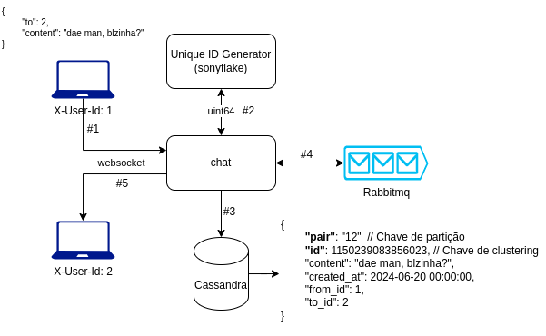

# chat-system

Um chat simples de mensagens com uma funcionalidade de presença.


## Rodando localmente

No diretório do projeto execute:

```bash
  docker compose up -d
```

Renomeie o arquivo `.env.example` para `.env`:

```bash
  mv .env.example .env
```

Execute o script para preparar o banco de dados:

```bash
  docker exec -it cassandra-chat cqlsh -f /docker-entrypoint-initdb.d/init.cql
```

Inicie o servidor HTTP:

```bash
  go run cmd/chat_service_http/main.go
```


## Utilizando a API

Adicione `X-User-Id` no header de todas as requisições com um valor qualquer valor inteiro.

#### Conexão websocket para envio e recebimento de mensagens

```http
  GET v1/chat/ws
```

| Corpo (JSON)   | Tipo       | Descrição                           |
| :---------- | :--------- | :---------------------------------- |
| `to` | `int` | **Obrigatório**. Id do usuário que receberá a mensagem |
| `content` | `string` | **Obrigatório**. Conteúdo da mensagem |

#### Conexão websocket para envio e recebimento de presença

A identificação de presença é feita automaticamente por pings e pongs. Então não é necessário enviar nada.

```http
  GET /v1/presence/ws
```

#### Obter mensagens de uma conversa

```http
  GET v1/chat/messages
```

| Corpo (JSON)   | Tipo       | Descrição                           |
| :---------- | :--------- | :---------------------------------- |
| `to` | `int` | **Obrigatório**. Id do usuário que foi enviado a mensagem |
| `beforeId` | `int` | Id da mensagem. Recupera mensagens enviadas antes do id especificado|


## Fluxo de mensagem


1. Usuário 1 envia json pelo websocket
2. Gera um Id único ordenável
3. Insere no banco de dados Cassandra
4. Envia a mensagem para a fila
5. Usuário 2 recebe a mensagem

